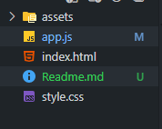

#  Proyecto: Amigo Secreto 

Este proyecto es una aplicación web sencilla para organizar un sorteo de "Amigo Secreto". Permite agregar participantes, mostrarlos en una lista y seleccionar aleatoriamente uno de ellos. Fue desarrollado con **HTML**, **CSS** y **JavaScript** como parte de un desafío de lógica de programación.

---

## 🚀 Funcionalidades

- Agregar nombres a una lista de participantes.
- Mostrar los nombres en pantalla.
- Sortear aleatoriamente un nombre de la lista.
- Limpiar el campo de entrada después de agregar.
- Interfaz amigable y responsive.

---

## 🛠️ Tecnologías utilizadas

- **HTML**: estructura del contenido.
- **CSS**: estilos visuales y diseño.
- **JavaScript**: lógica de programación y manipulación del DOM.

---

## 📸 Vista previa

> Puedes agregar aquí una captura de pantalla del proyecto si lo deseas.

---

## 📂 Estructura del proyecto




---

## 📋 Cómo usar

1. Clona el repositorio:

```bash
git clone https://github.com/Fabskun/challenge-amigo-secreto.git


2. Abre el archivo index.html en tu navegador.
3. Escribe nombres en el campo de entrada y haz clic en "Agregar".
4. Haz clic en "Sortear" para elegir un participante al azar.

---

✨ Mejoras futuras
- Validar nombres duplicados.
- Permitir eliminar participantes.
- Mostrar el resultado del sorteo en pantalla.
- Animaciones o efectos visuales.

---

🧠 Autor
Carlos Fabián Hernández Cruz
Apasionado por el desarrollo web y la lógica de programación.

📄 Licencia
Este proyecto está bajo la licencia MIT. Puedes usarlo, modificarlo y compartirlo libremente.
